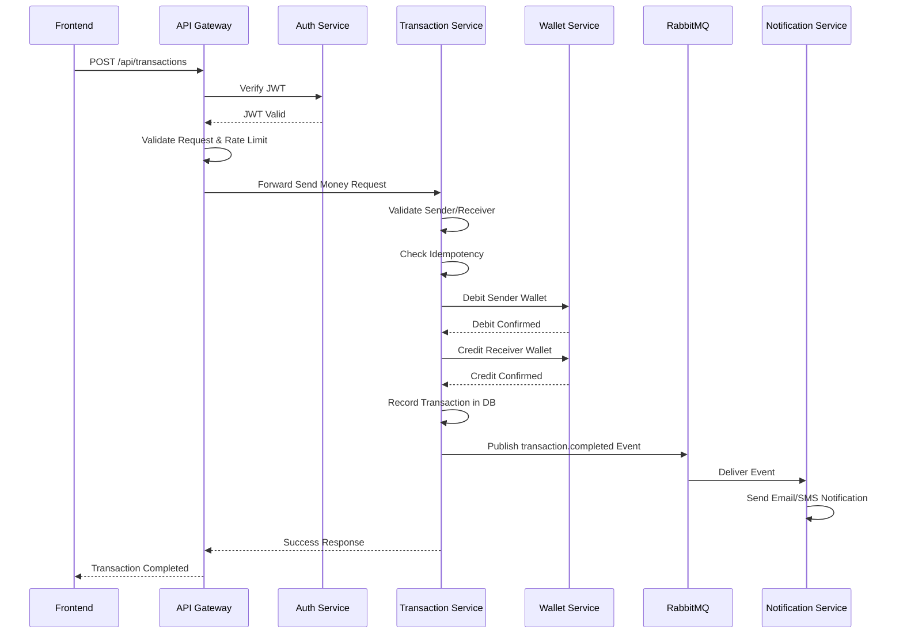

# PayFlow Microservices Architecture Documentation

**Repository:** [PayFlow](https://github.com/Ship-With-Zee/payflow-wallet.git) — Production-ready fintech microservices platform  
**Purpose:** Understand app architecture, service responsibilities, communication flows, and request traces.

This repository provides a comprehensive breakdown of the PayFlow system, including:

- Architecture overview
- Microservice responsibilities
- Ports, environment variables, and dependencies
- Full “Send Money” request flow
- Sequence diagram
- Databases, cache, and message queue

---

## 1. Architecture Overview

```
📱 Frontend (React)
        │
        ▼
🌐 API Gateway (Port 3000)
        │
        ├─── HTTP ───► 🔐 Auth Service (Port 3004)
        │                    │
        ├─── HTTP ───► 🔄 Transaction Service (Port 3002)
        │                    │
        ├─── HTTP ───► 💰 Wallet Service (Port 3001)
        │                    │
        └─── HTTP ───► 🔔 Notification Service (Port 3003)
                             │
                             │
        ┌────────────────────┼────────────────────┐
        │                    │                    │
        ▼                    ▼                    ▼
🗄️ PostgreSQL          🔴 Redis            📨 RabbitMQ
(users, wallets,    (tokens, cache,      (notification
 transactions)        idempotency)          events)
        ▲                    ▲                    │
        │                    │                    │
        └────────────────────┴────────────────────┘
                    (All services connect)
```


> **Note:** API Gateway is the single entry point for frontend requests.
Explanation:
The Frontend communicates only with the API Gateway. All services are decoupled and communicate via HTTP or RabbitMQ events. Databases (PostgreSQL) store persistent data, and Redis is used for caching and token management.

---

## 2. Services

### **API Gateway**
- **Purpose:** Entry point for all client requests; handles authentication, validation, rate limiting, metrics, and routing.
- **Port:** 3000
- **Env Vars:** `AUTH_SERVICE_URL`, `WALLET_SERVICE_URL`, `TRANSACTION_SERVICE_URL`, `NOTIFICATION_SERVICE_URL`, `CORS_ORIGIN`, `PORT`
- **Dependencies:** Auth, Wallet, Transaction, Notification, Redis, shared modules
- **Responsibilities:**
  - JWT verification
  - Request validation
  - Circuit breakers and retries
  - Metrics collection (Prometheus)

---

### **Auth Service**
- **Purpose:** Handles registration, login, logout, token refresh, password management
- **Port:** 3004
- **Env Vars:** `DB_HOST`, `DB_PORT`, `DB_USER`, `DB_PASSWORD`, `DB_NAME`, `JWT_SECRET`, `REDIS_URL`
- **Dependencies:** PostgreSQL, Redis, shared modules
- **Responsibilities:**
  - Verify tokens for API Gateway and services
  - Audit logs for user activity

---

### **Wallet Service**
- **Purpose:** Manages wallets, balances, credit/debit operations
- **Port:** 3001
- **Env Vars:** `DB_HOST`, `DB_PORT`, `DB_USER`, `DB_PASSWORD`, `DB_NAME`, `REDIS_URL`
- **Dependencies:** PostgreSQL, Redis, Transaction Service, shared modules
- **Responsibilities:**
  - Debit and credit wallets
  - Return wallet info to API Gateway
  - Ensure atomicity using idempotency

---

### **Transaction Service**
- **Purpose:** Handles money transfers, validates balances, creates transactions
- **Port:** 3002
- **Env Vars:** `DB_HOST`, `DB_PORT`, `DB_USER`, `DB_PASSWORD`, `DB_NAME`, `WALLET_SERVICE_URL`, `AUTH_SERVICE_URL`, `RABBITMQ_URL`, `REDIS_URL`
- **Dependencies:** Wallet Service, RabbitMQ, shared modules
- **Responsibilities:**
  - Validate sender and receiver
  - Debit/credit wallets
  - Create transaction records
  - Publish events to RabbitMQ

---

### **Notification Service**
- **Purpose:** Sends asynchronous notifications via email/SMS
- **Port:** 3003
- **Env Vars:** `RABBITMQ_URL`, `EMAIL_HOST`, `EMAIL_USER`, `EMAIL_PASSWORD`, `TWILIO_SID`, `TWILIO_TOKEN`
- **Dependencies:** RabbitMQ, shared modules, email/SMS providers
- **Responsibilities:**
  - Consume RabbitMQ events
  - Send transaction or account notifications

---

### **Frontend**
- **Purpose:** React SPA for user interaction
- **Dependencies:** API Gateway
- **Responsibilities:**
  - Sends API requests to Gateway
  - Displays wallet balances, transactions, notifications

---

## 3. Shared Modules

| Module | Purpose |
|--------|---------|
| circuit-breaker.js | Prevent cascading failures |
| idempotency.js | Prevent duplicate requests |
| logger.js | Centralized logging |
| metrics.js | Prometheus metrics |
| retry.js | Retry logic for failed calls |
| tracing.js | Distributed request tracing |

---

## 4. Send Money Flow (Full Trace)

**Scenario:** User A sends $50 to User B

1. **Frontend:** POST `/api/transactions` → API Gateway
2. **API Gateway:**
   - Verify JWT via Auth Service
   - Validate request
   - Apply rate limit
   - Forward to Transaction Service
3. **Transaction Service:**
   - Validate sender/receiver
   - Check idempotency
   - Debit sender wallet → Wallet Service
   - Credit receiver wallet → Wallet Service
   - Create transaction record in PostgreSQL
   - Publish `transaction.completed` event → RabbitMQ
4. **Notification Service:** Consume RabbitMQ event → send email/SMS
5. **API Gateway:** Return response → Frontend updates UI

---

### Sequence Diagram (Mermaid)



---

## 5. **Databases, Cache, and Queue.**

| Component   | Purpose                                    |
|------------|--------------------------------------------|
| PostgreSQL  | Users, wallets, transactions, audit logs  |
| Redis       | Token blacklist, idempotency, caching     |
| RabbitMQ    | Async messaging for notifications         |

---

## 6. **Environment Variables Summary.**

| Service             | Key Env Vars                                                                                      |
|--------------------|--------------------------------------------------------------------------------------------------|
| API Gateway         | AUTH_SERVICE_URL, WALLET_SERVICE_URL, TRANSACTION_SERVICE_URL, NOTIFICATION_SERVICE_URL, CORS_ORIGIN, PORT |
| Auth Service        | DB_HOST, DB_PORT, DB_USER, DB_PASSWORD, DB_NAME, JWT_SECRET, REDIS_URL                            |
| Wallet Service      | DB_HOST, DB_PORT, DB_USER, DB_PASSWORD, DB_NAME, REDIS_URL                                        |
| Transaction Service | DB_HOST, DB_PORT, DB_USER, DB_PASSWORD, DB_NAME, WALLET_SERVICE_URL, AUTH_SERVICE_URL, RABBITMQ_URL, REDIS_URL |
| Notification Service| RABBITMQ_URL, EMAIL_HOST, EMAIL_USER, EMAIL_PASSWORD, TWILIO_SID, TWILIO_TOKEN                  |

---

## 7. **Summary Table — Who Talks to Who.**

| Service                  | Talks To                                | Reason                                |
| ------------------------ | --------------------------------------- | ------------------------------------- |
| **API Gateway**          | Auth, Wallet, Transaction, Notification | Single entry point for all requests   |
| **Transaction Service**  | Wallet Service                          | Debit & Credit operations             |
| **Transaction Service**  | Auth Service                            | Validate user token (optional)        |
| **Transaction Service**  | RabbitMQ                                | Publish transaction events            |
| **Notification Service** | RabbitMQ                                | Consume events and send notifications |
| **Wallet Service**       | None                                    | Only responds to requests             |
| **Auth Service**         | None                                    | Only responds to requests             |
| **RabbitMQ**             | Notification Service                    | Event-driven async notifications      |

---

## 8. **Notes.**

API Gateway is the single entry point for all frontend requests.

Services communicate internally via HTTP requests and RabbitMQ events.

Shared modules enforce reliability, idempotency, logging, metrics, and retries.

PostgreSQL and Redis are critical for persistence and cache/state management.

RabbitMQ decouples notifications for asynchronous processing.

